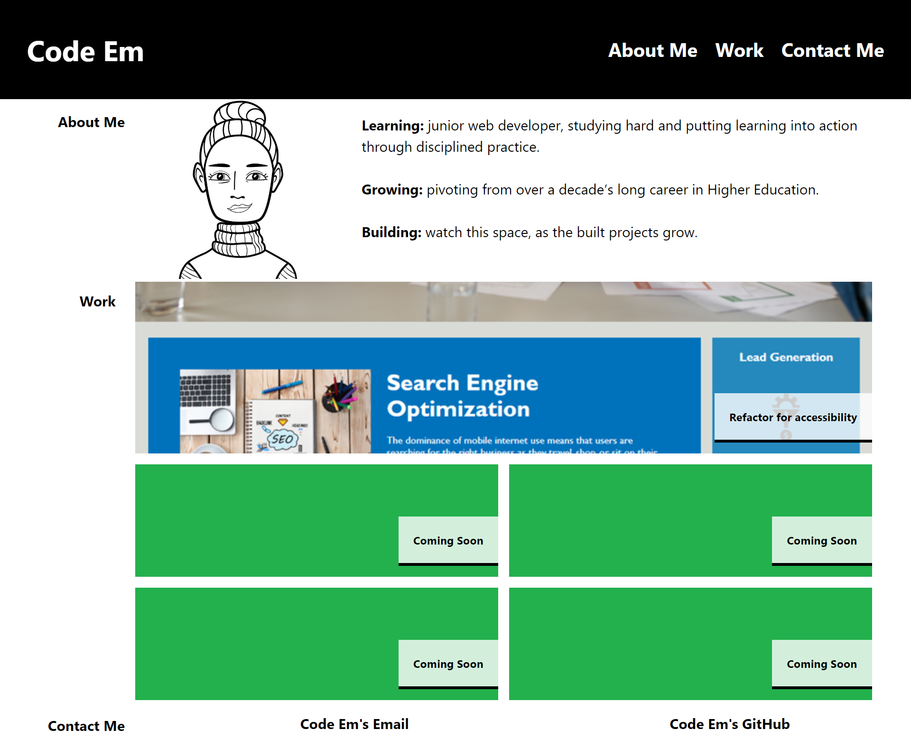

# Web Developer’s Professional Page

## Contents

* [Description](#description)
* [Development, Build and Limitations](#development)
* [Installation](#installation)
* [Usage](#usage)
* [Credits](#credits)
* [License](#license)
* [Acknowledgments](#acknowledgments)
* [References](#references)

## Description

The aim of this project was to build a portfolio to showcase the developer’s work. The motivations for this included bolstering the developer’s public image and consolidating their deployed applications into a ‘one-stop-shop’ that is easily accessible to potential employers.

The project criteria included creating a page that displays the developer’s name, avatar and sections to portfolio their recent work and display their contact details. 

The specification for the portfolio section (called “Work”) was to include a larger image of the first project showcased in this section.

The page was also required to be responsive on various screens and devices.

## Development, Build and Limitations

Wireframes were created to demonstrate the page layout on different devices/screens, based on the recommended breakpoints for large (1008px and larger), medium/ small (641px to 1007px; 640px to 376px) and mobile (less than 376px) (Microsoft, 2023; Medium, 2023).

### Wireframe for large (1008px and larger)

### Wireframe for medium and small (641px to 1007px; 640px to 376px)

### Wireframe for mobile (less than 376px)

 

To meet the aims of the project and build the page (as per the wireframes above), CSS flexboxes, grids and media queries were added into the original starter code.

On the current build, three individual CSS grids have been used to structure the “About me”, “Work” and “Contact me” sections respectively. Yet, on reflection, a CSS grid applied to the `<main>` element may have been a better approach; for example, this would have allowed for easier symmetry across the three sections.

The design for mobile is also, arguably, a ‘pared down’ version of the design for larger resolutions. To combat this, a mobile-first approach could have been considered from the outset (Interaction Design Foundation, 2016).

## Installation

N/A

## Usage

Users navigate to the webpage via the URL ([Code Em - Web Developer](ADD LINK WHEN DEPLOYED). When on the webpage, (on resolutions of 376 or greater), users can navigate to different sections of the page via the hyperlinks in the navigation bar (top right of the page).

To visit the projects showcased on the page, users can select the project’s image or header and will be navigated to said project’s external page.

The webpage on a resolution of 1008px (or higher) will display as follows:

Note: On resolutions of 1007px or below, the avatar in the “About Me” section is not displayed. On resolutions of 375 or below, the header/navigation bar (across the top of the page) and the section headers (to the left of the page) are not displayed.

## Credits

Credit given to edX (2023) for providing the starter code, as well as for code adapted for the headers displayed over the project images in “Work” (credit also cited in code comments).

Credit given to CSS-Tricks (2014), whose article helped to solve an issue with unintended body overflow (credit also cited in code comments).

Credit given to Excalidraw (2023), which was used to create the wireframes for the build. Credit also given to the avatar-maker tool, which was used to create the avatar displayed in “About Me”. Other credits have been cited above, and all references listed below. 

## License

Distributed under the MIT License. See `LICENSE.txt` for more information.

## Acknowledgments

Wireframes created and code written by Code0Em ([email](mailto:code.em@outlook.com)/ [GitHub](https://github.com/Code0Em)).

## References

Anon (no date) [*Avatar Maker*](https://avatarmaker.com).

CSS-Tricks (2014) [*Finding/Fixing Unintended Body Overflow*](https://css-tricks.com/findingfixing-unintended-body-overflow/).

edX (2023) [*Build new skills. Advance your career*](https://www.edx.org/).

edX (2023) *Skillsbootcamp in Front End Web Dev*. Module 2: Lesson 02: Activity 02.

Excalidraw (2023) [*Hand-drawn look & feel*](https://excalidraw.com/).

Interaction Design Foundation (2016) [*What is Mobile First?*](https://www.interaction-design.org/literature/topics/mobile-first).

Microsoft Learn (2023) [*Screen sizes and break points for responsive design*](https://learn.microsoft.com/en-us/windows/apps/design/layout/screen-sizes-and-breakpoints-for-responsive-design).
